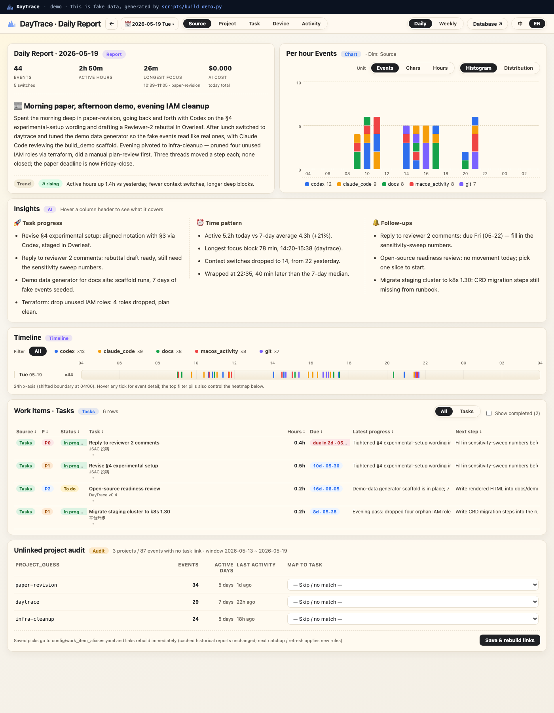

<p align="left">
  
</p>

**Your day, traced from the signals your AI tools already emit.**

> 🌐 [Live demo](https://xingminw.github.io/daytrace/demo/) ·
> [Landing page](https://xingminw.github.io/daytrace/) ·
> [中文版](https://xingminw.github.io/daytrace/index.zh.html) /
> [README](README.zh.md)

Codex, Claude Code, Cursor, DeepSeek — these are how your real work
happens now. They generate enormous, fragmentary signal about what you
were doing all day, and almost none of it is captured in any system
designed for *you*. Calendars miss it. Trackers manufacture it.

DayTrace is a **local-first personal trace system** that quietly
collects the same signal your AI tools already emit, joins it to your
local code and documents, and turns it into a daily and weekly
narrative *you actually want to read* — anchored on your real tasks,
written in your voice, owned entirely on your machine.

> Built for one person (the author) on macOS. Open-source so you can
> steal the parts you like.

```
collectors                SQLite events           AI overview          delivery
─────────────             ──────────────         ────────────         ─────────────
claude_code      ┐       events                 narrative            live dashboard
codex            ├──►    day_report      ──►    highlights    ──►    (via Tailscale)
git              │       day_channel            work_pattern         Feishu Docs
docs             │       work_items             suggestions          Gmail (HTML)
hermes (Feishu)  │       event_work_…           trend                inline charts
ssh remotes      ┘                              DeepSeek
```

One SQLite file is the entire system of record. One DeepSeek call per
day writes the narrative. One Mac is the hub; other machines feed it
via SSH. No DayTrace cloud, no telemetry, no third party touches your
data without your config saying so.

## What it looks like

<p align="center">
  <a href="https://xingminw.github.io/daytrace/demo/">
    
  </a>
  <br>
  <em>Daily report — <a href="https://xingminw.github.io/daytrace/demo/">live demo</a> ·
  <a href="https://xingminw.github.io/daytrace/demo/weekly.html">Weekly view</a> ·
  <a href="https://xingminw.github.io/daytrace/demo/index.zh.html">中文</a></em>
</p>

## What you actually see

- **A 4-tile dashboard** — events / active hours / longest focus / AI cost
- **A short daily narrative** in your voice
  > *"Spent the morning deep in paper-revision, going back and forth with
  > Codex on the §4 wording. After lunch switched to daytrace and tuned the
  > demo data generator. Evening pivoted to infra-cleanup…"*
- **3-column Insights** that don't get cute:
  - 🚀 **Task progress** — real Feishu tasks moved today, with concrete actions
  - ⏰ **Time pattern** — today vs a 7-day baseline (no generic productivity advice)
  - 🔔 **Follow-ups** — deadlines closing in, tasks gone N days without a touch
- **Charts that match the dashboard** — stacked bars by task, donut totals,
  embedded inline in the email and in the Feishu cloud document
- **A per-day weekly timeline** so the week's narrative isn't a flat
  recap but a sequence you can scan
- **An audit panel** when the collectors guess wrong on project → task

## Quick start

```bash
git clone https://github.com/xingminw/daytrace
cd daytrace
make install                          # PyYAML, matplotlib, Markdown

# Configure data sources for this machine
$EDITOR config/devices/mac.yaml       # enable collectors you want
$EDITOR config/work_items.yaml        # point at your Feishu Bitables

# DeepSeek + Gmail credentials (optional but recommended)
mkdir -p ~/.daytrace && chmod 700 ~/.daytrace
cat > ~/.daytrace/secrets.env <<'EOF'
DEEPSEEK_API_KEY=sk-...
DAYTRACE_GMAIL_USER=your-agent@gmail.com
DAYTRACE_GMAIL_APP_PASSWORD=xxxxxxxxxxxxxxxx
DAYTRACE_EMAIL_TO=you@example.com
EOF
chmod 600 ~/.daytrace/secrets.env

# Run it
make daily          # collect + AI overview for yesterday
make dashboard      # open http://127.0.0.1:8765/today

# Scheduled — three macOS launchd jobs do the rest
# (see docs/setup.md for install/uninstall + Tailscale Serve)
```

`make help` lists every target.

## Layout

```
daytrace/          core library
  schema.py          canonical TraceEvent shape
  db.py              SQLite schema + queries (18 tables, version 15)
  channels.py        channel registry + dependency orchestrator
  stats.py           deterministic stats channels (7 day, 6 day-project)
  ai_client.py       thin DeepSeek HTTPS client (stdlib only)
  ai_report.py       5 AI channels — narrative, trend, work_pattern…
  daily_report.py    façade — regenerate_day_from_db + load_day_report
  work_items.py      Feishu Bitable sync + event ↔ task linker
  report_export.py   Markdown body
  report_charts.py   matplotlib PNG charts (palette matches dashboard)
  report_delivery.py Feishu Docs import + Gmail SMTP
dashboard/         HTTP server + page renderers (single-file, no framework)
scripts/           CLI: collect_*, run_daily, export_report, …
deploy/            launchd plists (daily 04:30, weekly Mon 06:00, dashboard 24/7)
config/            yaml — devices, sources, work_items, aliases, remotes
tests/             pytest suite (79 tests)
docs/              architecture + setup + data-model
data/              all runtime — sqlite, inbox staging, logs, rendered reports
```

## Documentation

Three docs, each written against the actual code:

- **[Architecture](docs/architecture.md)** — pipeline, module map,
  channel registry, multi-device hub model, dashboard routes
- **[Setup](docs/setup.md)** — install, every config file, secrets,
  scheduled tasks, Tailscale Serve, Feishu Docs + Gmail delivery
- **[Data Model](docs/data-model.md)** — every SQLite table, the
  `events_hash` cache invalidation contract, schema migrations

## License

[MIT](LICENSE) — do what you want; if it breaks, you keep both pieces.

DayTrace processes your personal data. By design, it never sends data
anywhere except the destinations you configure (DeepSeek for AI
summarization, Feishu Drive for the cloud doc, your own Gmail for
delivery). No DayTrace cloud, no telemetry.
