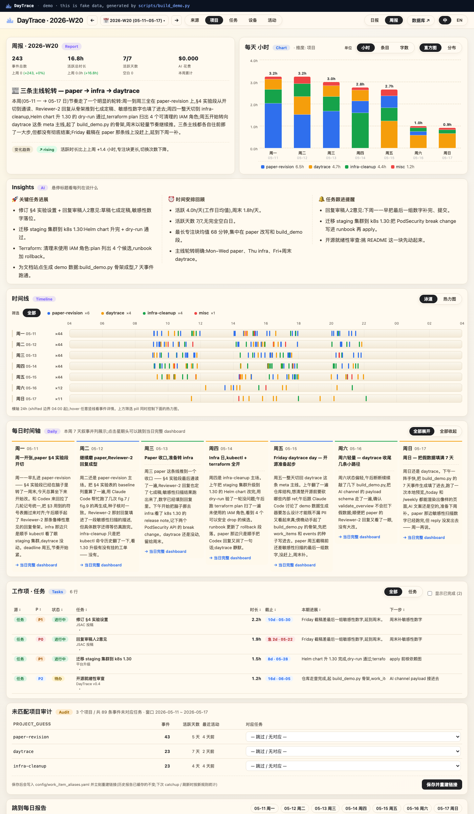

<p align="left">
  
</p>

**让你重新拥有自己的工作数据 —— 在 AI 工具成为主要入口的时代。**

> 🌐 [在线 demo](https://xingminw.github.io/daytrace/demo/index.zh.html) ·
> [落地页](https://xingminw.github.io/daytrace/index.zh.html) ·
> [English](https://xingminw.github.io/daytrace/) /
> [README](README.md)

Codex、Claude Code、Cursor、DeepSeek —— 真正的工作都在这些工具里发生。
它们留下海量、碎片化、关于你一天在干什么的信号,但几乎没有一个系统是
为**你自己**设计来归集它们的。日历记不到。工时打卡器只会编造数据。

DayTrace 是一个 **local-first 的个人工作轨迹系统**:它静默地收集 AI 工具
本来就在产生的信号,与你本地的代码、文档关联起来,然后把它们变成
一份你**真正会想读**的日报和周报 —— 锚定在真实任务上,用你的口吻,
完全保存在你自己的机器上。

> 为作者本人(macOS 单用户)而建。开源出来,你可以挑你喜欢的部件用。

<p align="center">
  <a href="https://xingminw.github.io/daytrace/demo/index.zh.html">
    
  </a>
  <br>
  <em>周报 — <a href="https://xingminw.github.io/daytrace/demo/index.zh.html">在线 demo</a> ·
  <a href="https://xingminw.github.io/daytrace/demo/daily.zh.html">日报视图</a> ·
  <a href="https://xingminw.github.io/daytrace/demo/">English</a></em>
</p>

```
collectors                SQLite 事件库          AI 速读              投递
─────────────             ──────────────         ────────────         ─────────────
claude_code      ┐       events                 叙事                  实时 dashboard
codex            ├──►    day_report      ──►    关键进展      ──►    (Tailscale)
git              │       day_channel            时间安排             飞书云文档
docs             │       work_items             任务跟进             Gmail (HTML)
hermes(飞书)      │       event_work_…           变化趋势             图表内嵌
ssh 远端机        ┘                              DeepSeek
```

一个 SQLite 文件就是整个系统的真理来源。每天一次 DeepSeek 调用生成叙事。
一台 Mac 作为 hub,其它机器通过 SSH 汇集过来。**没有 DayTrace 云,没有遥测**,
除非你的配置写明,否则任何第三方都不会碰到你的数据。

## 实际看到什么

- **4 格 dashboard** —— 事件数 / 活跃时长 / 最长专注 / AI 花费
- **一段日记体叙事**,用你自己的口吻
  > *"早上一头扎进 Daily briefing 开发项目, 跟 Codex 来回拉扯飞书工作区结构…
  > 到了傍晚, 切到 DayTrace, 跟 Claude Code 讨论数据源…"*
- **3 列 Insights**,不耍花活:
  - 🚀 关键任务进展 —— 今天哪些飞书任务有了具体推进
  - ⏰ 时间安排回顾 —— 今天对比近 7 天均值(不写空泛"提升效率"那一套)
  - 🔔 任务跟进提醒 —— deadline 临近、N 天没动、未提交改动的任务
- **跟 dashboard 一致的图表** —— 按任务堆叠柱图、总览饼图,邮件正文内嵌,
  飞书云文档里也内嵌
- **周报有逐天时间轴**,周叙事不是平铺总结而是可扫的序列
- **审计面板**:collector 把项目识别错时,可以在网页里直接修正映射

## 快速上手

```bash
git clone https://github.com/xingminw/daytrace
cd daytrace
make install                          # PyYAML, matplotlib, Markdown

# 配置你这台机器要采集什么
$EDITOR config/devices/mac.yaml       # 启用对应的 collector
$EDITOR config/work_items.yaml        # 指向你的飞书多维表格

# DeepSeek + Gmail 凭据(可选但建议)
mkdir -p ~/.daytrace && chmod 700 ~/.daytrace
cat > ~/.daytrace/secrets.env <<'EOF'
DEEPSEEK_API_KEY=sk-...
DAYTRACE_GMAIL_USER=your-agent@gmail.com
DAYTRACE_GMAIL_APP_PASSWORD=xxxxxxxxxxxxxxxx
DAYTRACE_EMAIL_TO=you@example.com
DAYTRACE_REPORT_LANG=zh               # 邮件/飞书文档语言:zh 或 en(默认 en)
EOF
chmod 600 ~/.daytrace/secrets.env

# 跑一次
make daily          # 采集 + AI 总结昨天
make dashboard      # 打开 http://127.0.0.1:8765/today

# 定时任务 —— 三个 macOS launchd job 全自动
# (docs/setup.md 里有完整的安装/卸载 + Tailscale Serve 说明)
```

页面右上角有 `中 / EN` 切换;邮件和飞书文档的语言由 `DAYTRACE_REPORT_LANG`
env var 独立控制(默认 `en`,设为 `zh` 即中文)。

`make help` 列出所有命令。

## 目录结构

```
daytrace/          核心库
  schema.py          TraceEvent 数据结构
  db.py              SQLite 表结构 + 查询(18 张表,版本 15)
  channels.py        channel 注册表 + 依赖图编排器
  stats.py           确定性的统计 channel(7 个 day,6 个 day-project)
  ai_client.py       极简 DeepSeek HTTPS client(只用 stdlib)
  ai_report.py       5 个 AI channel —— 叙事 / 趋势 / work_pattern…
  daily_report.py    门面 —— regenerate_day_from_db + load_day_report
  work_items.py      飞书多维表格同步 + 事件↔任务链接器
  report_export.py   Markdown 正文
  report_charts.py   matplotlib PNG 图表(调色板和 dashboard 一致)
  report_delivery.py 飞书云文档导入 + Gmail SMTP
dashboard/         HTTP server + 页面渲染(单文件,无框架)
scripts/           CLI 入口:collect_*, run_daily, export_report, …
deploy/            launchd plist(每日 04:30,周一 06:00,dashboard 24/7)
config/            yaml —— 设备、数据源、任务表、别名、远端
tests/             pytest 套件(79 个测试)
docs/              架构 + 安装 + 数据模型
data/              全部 runtime —— sqlite、inbox 暂存、日志、报告
```

## 文档

三篇,每一篇都是对着实际代码写的:

- **[Architecture](docs/architecture.md)** ([中文](docs/architecture.zh.md))
  —— 流水线、模块表、channel 注册表、多设备 hub 模型、dashboard 路由
- **[Setup](docs/setup.md)** ([中文](docs/setup.zh.md))
  —— 安装、每个配置文件解释、secrets、定时任务、Tailscale Serve、飞书 + Gmail 投递
- **[Data Model](docs/data-model.md)** ([中文](docs/data-model.zh.md))
  —— 每张 SQLite 表、`events_hash` 缓存失效契约、schema 迁移

## 许可

[MIT](LICENSE) —— 想拿来干嘛都可以;弄坏了零件归你。

DayTrace 处理你的个人数据。设计上,数据只会发往**你自己配置过的地方**
(DeepSeek 做 AI 总结、飞书云盘存归档、你自己的 Gmail 投递)。没有
DayTrace 云,没有任何 telemetry。
